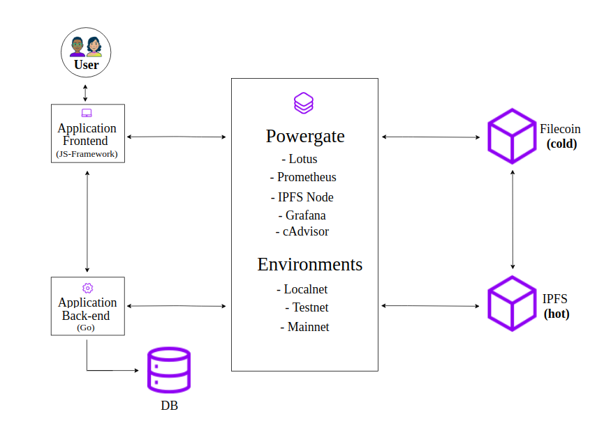

# specs
[Porium](https://github.com/realChainLife/porium) is a platform to develop tech skills through courses, bootcamps & trainings. Developers have the opportunity to learn various Web 3.0 technologies including:

- P2P internet overlay protocols e.g. Devp2p, Libp2p
- Platform-neutral computation description languages e.g. UTXO
- Layer one data distribution protocols (e.g. IPFS), low-trust interaction protocols & platforms like polkadot & polkadot parachains, and p2p data messeaging protocols like Matrix.

We also cover various layer two solutions and Protocol-extensible developer APIs & languages e.g. Web3.js, ether.js, Solidity, Rust.

This repo outlines the experimental build specifications of the platform highlighting the backend integrations using Textile's [Powergate](https://docs.textile.io/powergate/), a frontend js-framework and a postgresql database. 

    .
    +-- site-map
    |    +-- src (All browser extention & application files, assets & page-templates)
    |    +-- contracts (Functional core & base function clarity smart contracts)
    |    +-- test (Combines into tests the properties & functions of the contracts)  

Why this specific audio content based workflow? I’ll get to that and how these were implemented using Powergate later; first we need a brief overview of Powergate.

## Powergate

> The Powergate is an API driven solution for deploying multitiered storage across Filecoin and IPFS. Persistent storage on Filecoin allows rich storage configuration for data such as replication factor, miner selection, deal renewal, and repair

- [Lotus](https://lotu.sh/): A Lotus node running on the current Testnet.
- [IPFS Node](https://ipfs.io/) - A full IPFS node running to back Powergate FFS.
- [Prometheus](https://prometheus.io/) - The backend for metrics processing.
- [Grafana](https://grafana.com/) - Providing metrics dashboard.
- [cAdvisor](https://github.com/google/cadvisor) - Providing container metrics.

### Powergate APIs

- JS client API -
an easy to use JavaScript client for the Powergate APIs. https://textileio.github.io/js-powergate-client/

- Go client API - 
use the Powergate APIs from your go app by building directly on the Powergate Go Client. https://godoc.org/github.com/textileio/powergate/api/client

- Filecoin File System (FFS) API - 
API typed with Protocol Buffers https://github.com/textileio/powergate/blob/master/ffs/rpc/rpc.proto#L310

## Application Backend

### PostgreSQL Database

## Application Frontend

JS Framework - Angular, Svelte

## Contributions
Suggestions, contributions, criticisms are welcome.